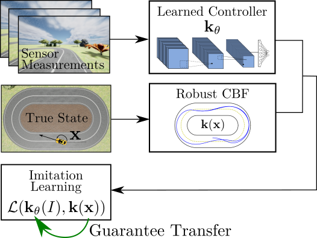
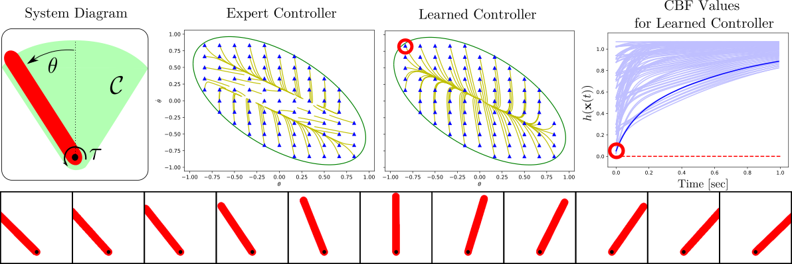
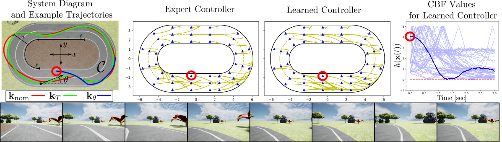

# End-to-End Imitation Learning with Safety Guarantees using Control Barrier Functions [[PDF]](https://www.rkcosner.com/assets/files/e2eIlCBF.pdf)

 

## Abstract
--- 
*Imitation learning (IL) is a learning paradigm 
which can be used to synthesize controllers for complex systems that mimic behavior demonstrated by an expert (user or control algorithm). Despite its popularity, IL methods generally lack guarantees of safety, which limits their utility for complex safety-critical systems. In this work we consider safety, formulated as set-invariance, and the associated formal guarantees endowed by Control Barrier Functions (CBFs). We develop conditions under which robustly-safe expert controllers, utilizing CBFs, can be used to learn end-to-end controllers (which we refer to as \textit{CBF-Compliant} controllers) that have safety guarantees. These guarantees are presented from the perspective of of input-to-state safety (ISSf) which considers safety in the context of disturbances, wherein it is shown that IL using  robustly safe expert demonstrations results in ISSf with the disturbance directly related to properties of the learning problem.  We demonstrate these safety guarantees in simulated vision-based end-to-end control of an inverted pendulum and a car driving on a track.*

--- 

## Introduction 
The use of learning in conjuction with control has become an increasingly popular area of study -- especially in the context of autonomous systems where control-theoretic properties must generalize to the real world. In our work we considered Imitation Learning (IL) and provided mathematical guarantees of safety for systems with end-to-end controllers generated via imitation learning. The preprint of our paper can be found at the pdf here: [[PDF]](https://www.rkcosner.com/assets/files/e2eIlCBF.pdf). 

### Imitation Learning
Several imitation learning methods exist including Behavioral Cloning (BC), Inverse Reinforcement Learning, and Data Aggregation (DAGGER). For our work we chose BC as our learning method due to its simplicity and our ability to demonstrate safety despite the compounding errors which present a common problem for Behavioral Cloning methods. However, our safety guarantees are not dependent on the BC formulation of the IL problem and generalize to IRL and DAGGER without any additional assumptions. 

### Control Barrier Functions

Safety of the learned controller in this work is due to a robust safety requirement of the expert demonstrations and sufficient sampling of regions of interest. In particular, we define safety as the forward invariance of some *safe set* that is a subset of the state space. The system is said to be safe if it remains in that safe set for all time. By enforcing a robust safety constraint for the expert controller we transfer a safety guarantee to the learned controller. 

---

## Simulation Results 

Simulated experiments were conducted for an inverted pendulum and a car driving around a track. Below are plots describing the experiments and the results: 

 

Results for the inverted pendulum. **Left:** A diagram of the system where the green represents the safe set . 
**Center Left:** One second long trajectories generated by the expert controller  are shown in yellow and plotted for several initial conditions represented as blue triangles. in The green ellipse marks the boundary . 
**Center Right**:  
One second long trajectories generated by the learned controller  are shown in yellow and plotted for several initial conditions represented as blue triangles. in The green ellipse marks the boundary . 
**Right:** CBF  values  achieved by the learned controller. Note all are greater than zero indicating safety of the system. The darker blue trajectory begins at the initial condition marked by the red circle in the plot of the learned controller. **Bottom:** Images spanning the safe set  that are used by  for end-to-end control of the system. 

 

Results for the car. **Left**: three 15 second long trajectories are shown starting from the same initial condition, the nominal controller generates the unsafe trajectory in red, the \ref{eq:trop} controller generates the safe green trajectory, and the learned controller generates the safe blue trajectory. **Center Left** :  3 second long trajectories starting at several initial conditions are shown for the expert controller . The red triangles represent initial conditions and are all within the safe set. The yellow lines represents the trajectories of the car beginning at a red triangle. 
**Center Right:**  3 second long trajectories for starting at several initial conditions shown for the learned controller . 
**Right:** CBF values  achieved by the learned controller. Note all are greater than zero. The darker blue trajectory begins at the inital condition shown by the red circles in each plot. 
**Bottom:** Images used by  for end-to-end control of the system. From left to right, each the first-person view of the system starting at time  seconds and increasing by 0.25 seconds.

Although the trajectories generated by the learned controller and the expert controller differ significantly, the safety requirement that  remain greater than sero is maintained for all tests for both experiment types. For more details, analysis, and discussion of the result, please see our full paper [here](https://www.rkcosner.com/assets/files/e2eIlCBF.pdf). 

--- 

## Simulation Code

TODO 
